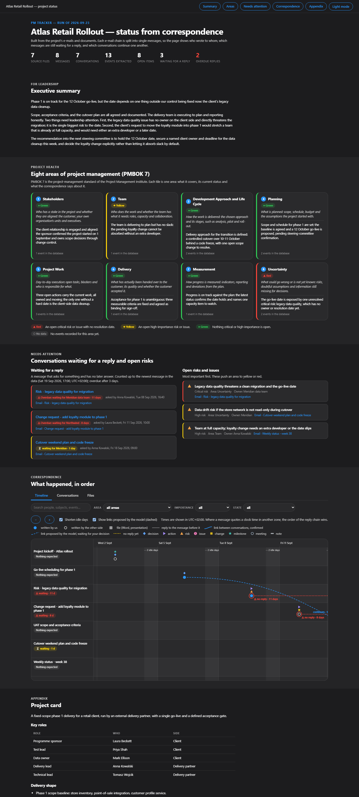

# Case study: PM Helper — an AI-assisted project tracking workspace

A working tool I designed and built to solve a problem every programme manager knows: project reality lives scattered across email chains, meeting notes, and documents, and staying on top of "what's open, who owes a reply, which conversation continues which" is manual, error-prone work.

PM Helper reads a project's correspondence and documents, breaks email chains into individual messages, flags what is waiting on a reply, proposes how conversations link together, and maintains a live status dashboard across the eight PMBOK 7 performance domains. The design principle throughout: **the AI reads and proposes, deterministic scripts verify, the project manager decides.**

> [`project/workspace-template/`](./project/workspace-template/) is the empty engine (no project data of any kind); [`project/_demo/`](./project/_demo/) is that same engine run end to end on the synthetic project shown below. Everything here is my own work; no confidential employer, client, or partner material is included.

## See it working (synthetic demo)

Below is a dashboard the tool generated from a fully synthetic project: seven emails from a fictional retail rollout, run through the whole pipeline. Every name, company, and event is invented for this demo.

What the screenshot shows the tool doing on its own, from raw correspondence:

- **A traffic-light read across all eight PMBOK 7 domains** — here Uncertainty is red (an open critical data-quality risk with no resolution date) and Team is amber (capacity), while the rest are green. The colour is derived from the events, not asserted.
- **A "waiting for a reply" queue** with how many days each request has gone unanswered, and which are overdue against the 3-day threshold.
- **A timeline** where a dashed blue line marks a link the model *proposed but a PM has not yet confirmed* (the cutover thread continuing the go-live thread), and dotted red marks a message with no reply. Approved fact and pending suggestion sit on one picture.
- **An executive summary and project card** written in plain language, no identifiers or area codes in the running text.

**Open the live dashboard: https://climbat1ze.github.io/wojciech-kajder-portfolio/case-studies/01-pm-helper/project/_demo/_outputs/dashboard.html**

It is a single self-contained page, no server or internet needed. The [`project/_demo/_outputs/sources/`](./project/_demo/_outputs/sources/) pages show the verbatim source text of each email, split into messages, with the evidence for every extracted event highlighted. A plain-text version is in [`project/_demo/_outputs/timeline_report.md`](./project/_demo/_outputs/timeline_report.md).

## The problem

On a real programme the source of truth is fragmented. A single `.msg` file is usually a whole thread; the same message shows up in three people's exports; a decision taken in one conversation quietly closes an action in another. Manually reconciling that is where PM attention leaks. I wanted a tool that ingests the raw material and gives me a governed, auditable status view without inventing facts or hiding how it got there.

## The approach

Four design decisions carry the tool, and each is a governance choice as much as a technical one.

1. **A hard line between script and model.** Extracting text from a file and writing it to the store is always deterministic script work — repeatable, verifiable. Judging what counts as an event, which domain it belongs to, what a document means is always model work. The two never blur. This keeps the parts that must be reproducible reproducible, and confines judgement to where judgement is actually needed.

2. **Human-in-the-loop by construction, not by convention.** Two things never take effect on the model's say-so alone: the project context itself, and any relationship that closes or cancels something else. Both route through a decision file the PM reads and approves. The dashboard even renders model-proposed links as dashed lines marked "to decide," so approved fact and pending suggestion sit on one picture.

3. **Evidence is inviolable.** Every extracted event carries a verbatim quote from its source, checksummed. A quote that can't be found in the source text gets a visible warning. The decision file carries both sides' context and the literal quotes, so the PM never has to open the originals to decide. Provenance is enforced, not promised.

4. **The filesystem is the orchestration layer.** The workspace is built on the Model Workspace Protocol (MWP, Van Clief & McDermott): layered context files (L0 identity → L4 per-run data), numbered stages that encode execution order, every intermediate output a plain-text surface the PM can open and correct before the next stage runs. It is fully self-contained — copy the folder anywhere and it runs identically.

## The result

A self-contained, portable workspace that turns raw project correspondence into a governed status view across all eight PMBOK 7 domains, with two clean flows (`context-intake` to establish the project, `pm-tracker` to process new material) and built-in consistency checks that must pass after every run. Duplicates are caught by content hash, not filename; the same message across multiple files collapses to one row; a browser-only dashboard renders the timeline, the "waiting on a reply" queue, and the conversation graph with no internet and no dependencies.

## Why this is a representative sample of how I work

This is the clearest artefact I have of my operating style as a programme manager, translated into a system:

- **Governance before automation.** The interesting engineering here is the restraint — deciding what the AI is *not* allowed to do on its own. That is the same instinct I bring to stage-gates and decision rights on a live programme.
- **Auditability as a first-class requirement.** Checksummed evidence, decisions logged where a reader can see who decided and when, no silent changes. If a decision can't be traced, it didn't happen properly.
- **Fluency in the PM canon.** The tool is organised around PMBOK 7's performance domains, not an ad-hoc taxonomy, and reports to management in full-named domains, never codes.
- **Building the thing, not just specifying it.** I'm a programme manager, not an engineer, but I can define a method precisely enough to make it real and stand behind the trade-offs in it.

## Explore the tool

- [`project/workspace-template/README.md`](./project/workspace-template/README.md) — how to run it (in Polish; the tool's working language).
- [`project/workspace-template/CLAUDE.md`](./project/workspace-template/CLAUDE.md) — the workspace identity and structure.
- [`project/workspace-template/_context/00_method.md`](./project/workspace-template/_context/00_method.md) — the eleven binding rules of the method.
- [`project/workspace-template/_flows/`](./project/workspace-template/_flows/) — the two flows and their staged pipelines.
- [`project/_demo/`](./project/_demo/) — the same engine run on synthetic data, with the generated knowledge base and dashboard.

---

*Case study by Wojciech Kajder. The tool is original work; the underlying MWP method is credited to Van Clief & McDermott.*
