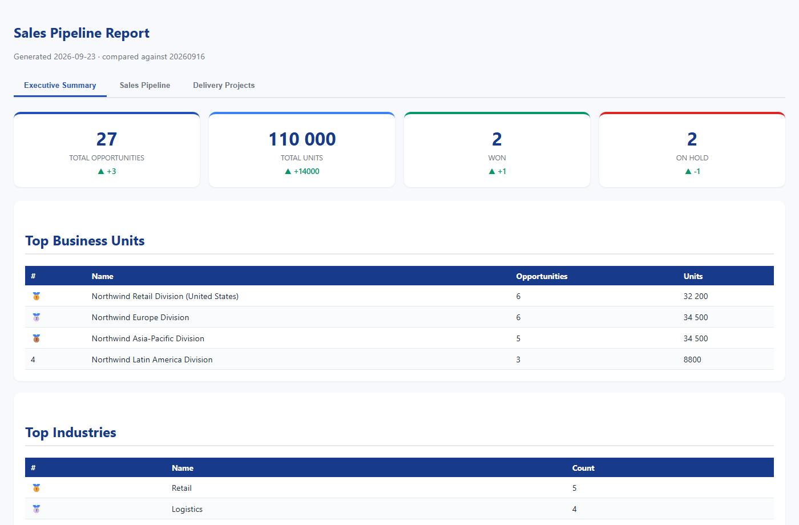

# Case study: Sales Pipeline Reference — a weekly report that survives the person who built it

If you have sat through another AI pilot this quarter, you know the shape of it: a clean demo, a round of enthusiasm, and nothing that survives contact with next week's data. This is deliberately the opposite. It is a plain, durable pipeline that turns a messy sales spreadsheet into a staged report and a sponsor dashboard, and it keeps doing it every week without a developer in the loop.

> Everything in [`project/_demo/`](./project/_demo/) is fictional (a made-up company, "Northwind", with invented accounts, people, and numbers). The method is the point, not the data. No real company data is included.

## The problem it actually solves

A team tracks its pipeline in a spreadsheet. The same owner's name is spelled three ways, "Healthcare" and "Health Care" and "Pharma" are one bucket, a business unit is a code one week and spelled out the next. Every week someone rebuilds a clean report, and the cleanup logic keeps drifting because it lives inside a script only one person can safely touch. When that person is busy, or leaves, the report degrades.

## What makes it durable, not just clever

Four choices, each aimed at the failure mode above rather than at a demo:

1. **The cleanup logic lives in Markdown tables, not in code.** Owner-name, industry, business-unit, and product mappings are plain tables in `_config/`. Adding a rule is editing a table row. Anyone can read and audit it; nobody is held hostage by the one person who understands the script.
2. **Deterministic core, LLM only where prose needs judgement.** Stages 0 to 2 and the KPI maths are ordinary code: same input, same output, every time. The model is used for one thing, turning the processed numbers into an executive narrative. You are not betting the weekly report on a model's mood.
3. **Every stage is a reviewable, re-runnable file handoff.** Each stage reads and writes a documented location and carries a one-page contract (inputs, transformation, outputs, checks). Fix a mapping table, re-run only stage 2 and 3, leave stage 1 alone.
4. **It fails loudly, not silently.** Values that do not match a known name or industry are flagged in a validation report, not quietly dropped. In the demo that is a real behaviour, not a claim (see below).

## Proof it ran, not a mockup

The demo report is genuine output from running the three stages against a fictional 27-row tracker, not a hand-drawn picture of what a report might look like. The validation step caught two deliberate edge cases and refused to guess:

- `Casey Whitfield` flagged `NOT_ON_ROSTER` (an external partner referral, not a team member)
- `OPS` flagged `NOT_PERSON` (a queue label someone typed into an owner column)

A system that surfaces the two rows it is unsure about is worth more to an operator than one that produces a confident, wrong total.

**See the live report:** https://climbat1ze.github.io/wojciech-kajder-portfolio/case-studies/02-sales-pipeline/project/_demo/_output/_final/pipeline_report_20260923.html

It carries week-over-week deltas (opportunities +3, units +14,000, won +1, on hold -1), top business units and industries, and separate tabs for two genuinely different pipelines (sales versus delivery) that are reported on their own terms rather than forced into one score.

## Why this matters to someone who has seen the slides

The interesting property here is not the output, it is that the output is cheap to keep producing correctly. The logic is legible, the model is confined to where it earns its place, and the whole thing is a folder you can copy, version, and hand to another team with no server and no vendor. That is the same instinct I bring to programme delivery: build the thing that still works in month six, not the thing that demos well in week one.

## Explore

- [`project/README.md`](./project/README.md) — the method and how to deploy it against real data.
- [`project/_demo/CLAUDE.md`](./project/_demo/CLAUDE.md) — a guided tour of what actually ran.
- [`project/_config/`](./project/_config/) — the mapping tables that hold the business logic.

---

*Case study by Wojciech Kajder. The tool is original work; the underlying filesystem-as-orchestration method is credited to Van Clief & McDermott (see the [reference materials](../../reference/)).*
