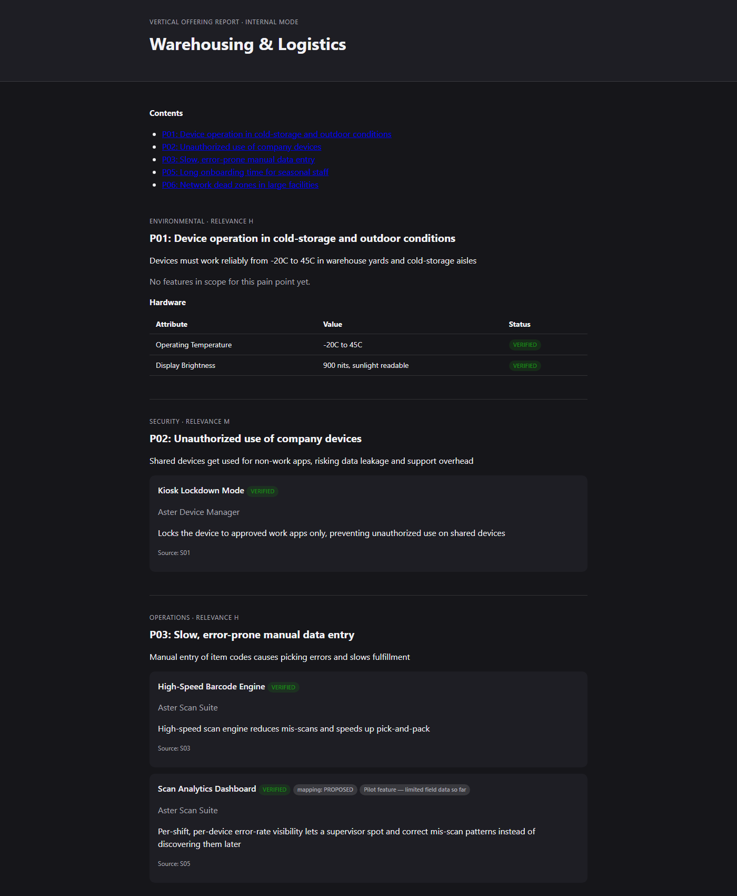

# Case study: Vertical Offering Generator — AI-authored sales collateral you can actually put your name on

"We'll use AI to generate our vertical sales collateral" is a pitch every transformation lead has heard, and watched die. It dies for one reason: the output is confidently wrong, unsourced, and no product owner will stake their name on sending it to a customer. This project is that pitch with the missing 80% built in: the governance that turns AI-drafted collateral from a liability into something a named person signs off and ships.

> Everything in [`project/_demo/`](./project/_demo/) is fictional: a made-up rugged-tablet line ("Aster Field Tablet") and an invented "Warehousing & Logistics" vertical. No real product or customer data is included.

## What it produces

From a mapping of product features to customer pain points to industry verticals, it generates a finished vertical offering document: each pain point for the target industry, the features that answer it, and the evidence behind each claim. The demo output is a real generated document, not a mockup.

**See the live document:** https://climbat1ze.github.io/wojciech-kajder-portfolio/case-studies/04-vertical-offering/project/_demo/_outputs/_final/2026-09-23_Vertical_Offering_Warehousing_Logistics_FINAL_v1.html

Look at what the document shows on its own face: every feature carries a source (`Source: S03`), a `VERIFIED` badge where a human confirmed it, and honest caveats where it has not (a `mapping: PROPOSED` tag, a "Pilot feature, limited field data so far" note, and "No features in scope for this pain point yet" where there genuinely are none). The provenance is on the page, not buried.

## The governance that makes AI authoring survivable

Five rules, enforced by the pipeline rather than by good intentions:

1. **`VERIFIED` can only be set by a human.** No script and no model marks its own output as confirmed. AI-assisted passes can only write `PROPOSED`.
2. **Every claim needs a citation or it is rejected.** A feature or pain point with no source does not get written with a blank citation; it does not get written at all.
3. **The LLM is confined to one stage, in two passes with a human in the middle.** The system composes a prompt, a person pastes it into a model and saves the reply, then a script ingests it, discards every ID the model invented, reassigns real ones, and lands the result at `PROPOSED`. The model never writes directly into the source of truth.
4. **Rejections are logged with reasons, not silently dropped.** A rejected proposal stays visible with the reviewer's reasoning recorded, so the same bad suggestion is not re-litigated every build.
5. **A build cannot be published without every relevant reviewer's approval, and there is no override flag.** The publish stage enforces it mechanically. Review emails are generated and routed to named PM owners ([see the review-gate output](./project/_demo/_flows/report-generation/stages/04_review_verify_gate/output/emails/)); approval is a gate, not a formality.

## Why this speaks to someone tired of AI pilots

The reason AI content pilots do not survive is trust, not capability. Models can draft; organisations cannot ship drafts nobody has verified to a customer. What is scarce, and what this builds, is the provenance and sign-off layer around the drafting: sourced claims, a hard human-verification boundary, logged rejections, and a publish gate with no bypass. That is the difference between a demo that impresses for a week and a pipeline a product organisation actually runs.

For a firm building an AI practice, the same point lands differently: this is a governed, repeatable authoring pipeline you can stand up per client, with the PM process (RACI, review cadence, feedback loop) written down in [`project/_demo/_pm-guides/`](./project/_demo/_pm-guides/), not improvised each time.

## Explore

- [`project/README.md`](./project/README.md) — the method, the two flows, and how to deploy it.
- [`project/_demo/CLAUDE.md`](./project/_demo/CLAUDE.md) — the rules that hold everywhere, and what actually ran.
- [`project/_demo/_pm-guides/`](./project/_demo/_pm-guides/) — the end-to-end PM process, RACI and governance.

---

*Case study by Wojciech Kajder. The tool is original work; the underlying filesystem-as-orchestration method is credited to Van Clief & McDermott (see the [reference materials](../../reference/)).*
